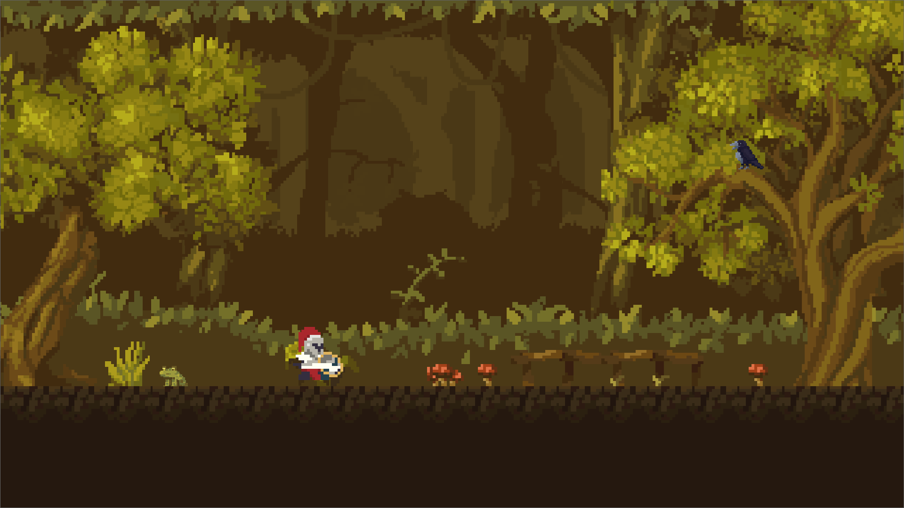

# 🩸 Blood experiment platformer

## 🇬🇧 English

**Blood experiment platformer** is a solo-developed 2D game built in **Godot**. This is just a fragment of the full experience — many features are still in development. Currently, the game is available only in **Polish**, but multi-language support is on the way.

### 🧪 Plot overview

You awaken in a forest after a mysterious break from life. Strange marks on your skin suggest injections — you fear infection, and that something is killing you from within. With each level, your character is getting weaker. You must rest, eat, drink, and sometimes rely on substances — which may lead to addiction.

Your goal: **examine your blood** and find a trustworthy doctor. But can anyone be trusted?

You begin your journey wearing medieval armor, wielding a sword and shield — found after a party in the woods. The story unfolds through environmental clues, cryptic notes, and NPC interactions. Themes include **trust**, **survival**, and the **psychological toll of isolation and uncertainty**.

### 🎮 Features in progress

- Adjustable settings  
- Multi-language support  
- Player inventory  
- NPCs and enemies  
- Collectibles  
- Music and sound effects  
- Scene and script reorganization  
- Emotions control  

### 🛠️ Currently working on

- Health bar *(added 18.07.2025 — still in progress)*  
- Saving and loading system *(last fix 20.07.2025 — still in progress)*  

### 🎨 Art Credits

- [Pixel Valley Platform Tiles by Kauzz](https://kauzz.itch.io/pixel-valley-plataform-tiles)  
- [Starstring Fields by Trixelized](https://trixelized.itch.io/starstring-fields)  
- [Knight Hero Platform by Pixivan](https://pixivan.itch.io/knight-hero-platfor)  
- [Crow by Shiaxs](https://shiaxs.itch.io/crow)  
- [Dark-owl-sprites by thespriteshop](https://thespriteshop.itch.io/dark-owl-sprites)  

### 🎼 Music Credits

- The soundtrack for the **main scene** (`world.tscn`) was composed by **Suno**.

### 🤖 AI Tools Used

- Microsoft Copilot  
- GitHub Copilot  
- ChatGPT  
- BIELIK.AI
- DeepSeek
- Claude

Each tool supported different aspects of development — from logic and scripting to writing and design.

---

### 🧭 Project Intent

This project is created **purely for entertainment and hobbyist purposes**. It is not being sold or distributed commercially in any form. The game is a personal creative journey — a passion-driven experiment — and is meant to be shared with friends, fellow developers, and curious gamers who appreciate atmospheric storytelling and platformer mechanics.

If you're playing it, giving feedback, or getting inspired: thank you! That means more than any kind of monetization ever could.

---

### 📱 Mobile Version Coming Soon…

---

## 🇵🇱 Polski

**Blood experiment platformer** to gra 2D tworzona przeze mnie samodzielnie w **Godot**. To tylko fragment pełnej wersji — wiele funkcji jest jeszcze w trakcie tworzenia. Obecnie gra dostępna jest tylko w **języku polskim**, ale planuję dodać obsługę wielu języków.

### 🧪 Zarys fabuły

Budząc się w lesie po tajemniczej przerwie od życia, odkrywamy dziwne ślady na skórze — być może po zastrzykach. Obawiamy się infekcji, a nasza postać słabnie z każdym poziomem. Musimy odpoczywać, jeść, pić, a czasem sięgać po substancje — co może prowadzić do uzależnienia.

Naszym celem jest **zbadanie krwi** i odnalezienie godnego zaufania lekarza. Ale czy można komukolwiek zaufać?

Rozpoczynamy w średniowiecznej zbroi, z mieczem i tarczą — znalezionymi po imprezie w lesie. Fabuła rozwija się poprzez wskazówki środowiskowe, tajemnicze notatki i interakcje z NPC. Gra porusza tematy **zaufania**, **przetrwania** oraz **psychologicznego wpływu izolacji i niepewności**.

### 🎮 Funkcje w trakcie tworzenia

- Konfigurowalne opcje  
- Obsługa wielu języków  
- Ekwipunek gracza  
- NPC i przeciwnicy  
- Kolekcje  
- Muzyka i efekty dźwiękowe  
- Przearanżowanie scen i skryptów  
- Kontrola emocji  

### 🛠️ Obecnie w trakcie prac

- Pasek zdrowia *(dodano 18.07.2025 — wciąż rozwijany)*  
- System zapisu i ładowania *(ostatnia poprawka 20.07.2025 — wciąż rozwijany)*  

### 🎨 Autorzy grafiki

- [Pixel Valley Platform Tiles by Kauzz](https://kauzz.itch.io/pixel-valley-plataform-tiles)  
- [Starstring Fields by Trixelized](https://trixelized.itch.io/starstring-fields)  
- [Knight Hero Platform by Pixivan](https://pixivan.itch.io/knight-hero-platfor)  
- [Crow by Shiaxs](https://shiaxs.itch.io/crow)  
- [Dark-owl-sprites by thespriteshop](https://thespriteshop.itch.io/dark-owl-sprites)  

### 🎼 Muzyka

- Utwór do głównej sceny (`world.tscn`) stworzył **Suno**.

### 🤖 Użyte narzędzia AI

- Microsoft Copilot  
- GitHub Copilot  
- ChatGPT  
- BIELIK.AI
- DeepSeek
- Claude

Każde z nich pomogło w innym aspekcie — od logiki i skryptów po pisanie i projektowanie.

---

### 🧭 Cel Projektu

Gra powstaje **wyłącznie w celach rozrywkowych i hobbystycznych**. Nie jest sprzedawana ani komercyjnie dystrybuowana. To osobista podróż twórcza — eksperyment zrodzony z pasji — którą chcę dzielić z przyjaciółmi, innymi twórcami i graczami ceniącymi atmosferyczne platformówki z narracją.

Jeśli grasz, zostawiasz opinię lub się inspirujesz — dziękuję! To dla mnie cenniejsze niż jakakolwiek monetyzacja.

---

### 📱 Wersja mobilna już w drodze…

